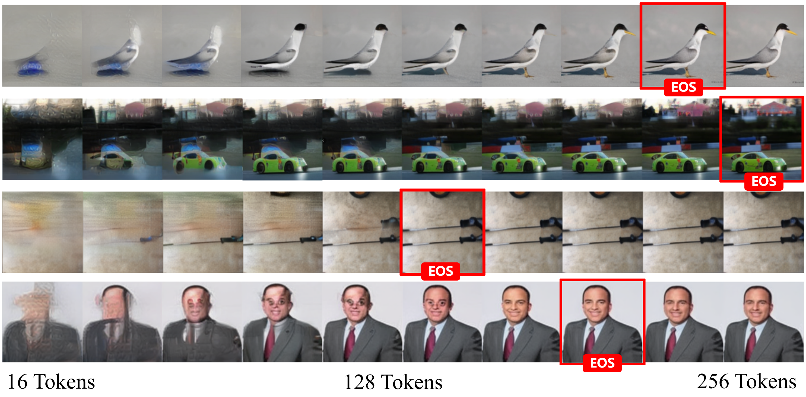
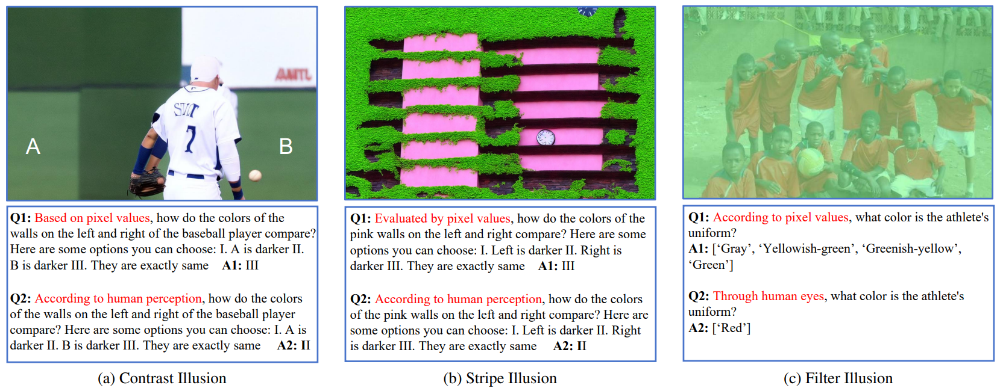
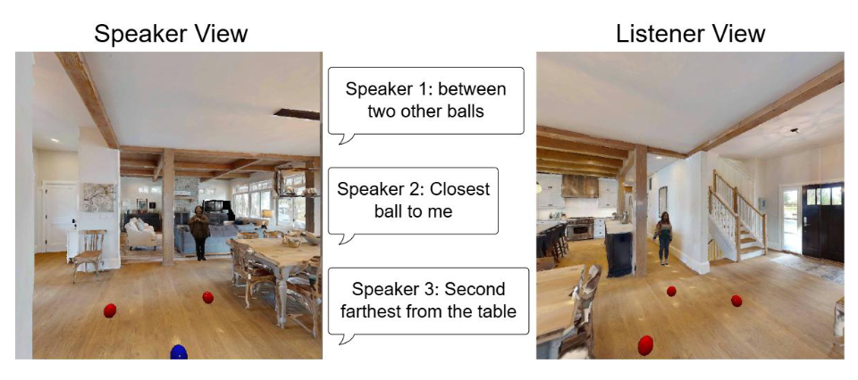
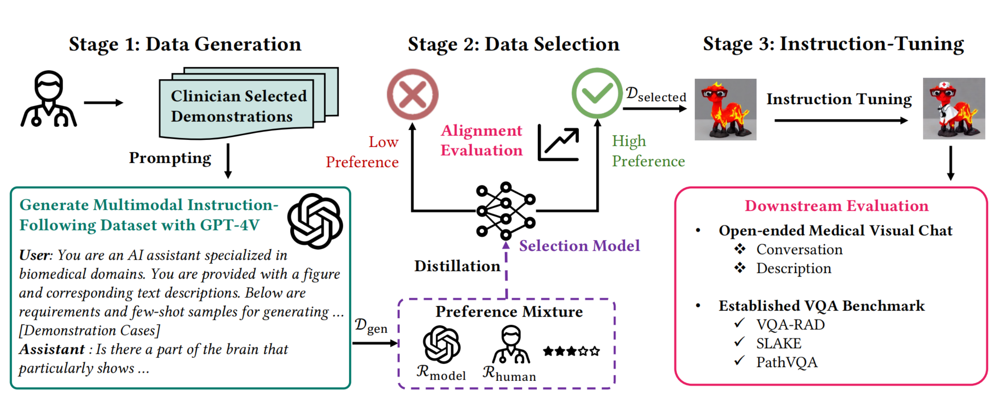
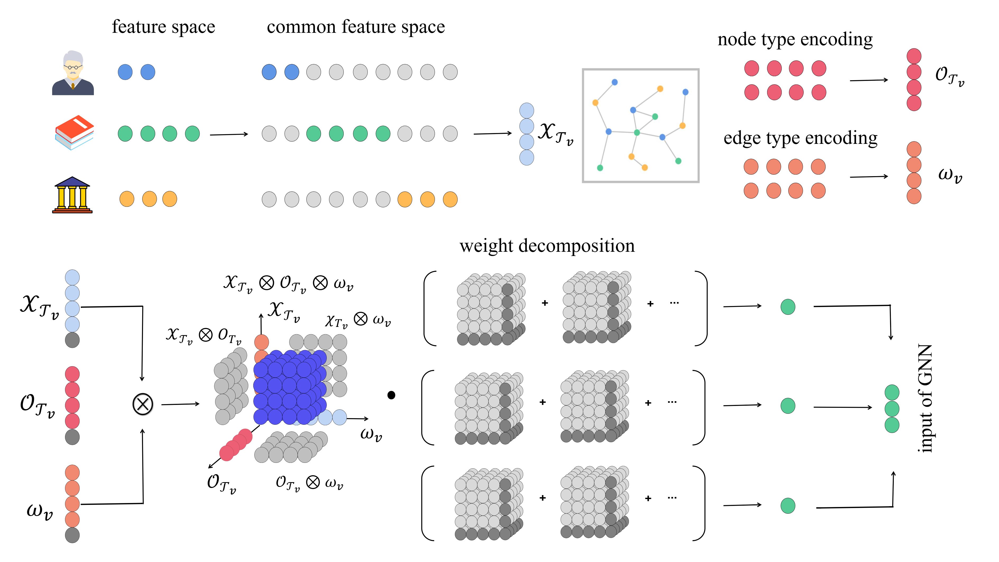








# Welcome! 
I am an first-year CS Ph.D. student at [University of California San Diego](https://cse.ucsd.edu/) (UCSD), advised by [Prof. Lianhui Qin](https://lianhui.ucsd.edu/). During my undergraduate studies, I was also a Visiting Researcher at the [Berkeley NLP Group](https://nlp.cs.berkeley.edu/), working closely with [Prof. Alane Suhr](https://www.alanesuhr.com/) and [Zineng Tang](https://zinengtang.github.io/).

My research focuses on **natural language processing**, **machine learning**, and **computer vision**. Currently, I am working on building intelligent agents (e.g., embodied agents and coding agents), as well as developing realistic world simulations (e.g., SimWorld) for agent training. In the long term, I aim to leverage increasingly realistic simulated worlds to systematically study the capability boundaries of current models in complex environments, and to explore how such environments can facilitate the learning and generalization of intelligent agents.

You can find my [CV](https://drive.google.com/file/d/1cYcl2w3z3J7tdv5NVDf3QYNRQ05bsLw6/view?usp=sharing) here. I am always open to any form of collaboration. If you have any ideas for potential collaboration, or just feel like having a casual chat, please feel free to reach out!

<!--I have published more than 100 papers at the top international AI conferences with total <a href='https://scholar.google.com/citations?user=DhtAFkwAAAAJ'>google scholar citations <strong>260000+</strong></a> (You can also use google scholar badge ).-->

<!--插入图片语法为：-->

# 🔥 News
- *2025.04*: &nbsp;Thrilled to join UCSD as a CS Ph.D. student. Looking forward to starting this new journey!🌴🌊☀️
- *2025.02*: &nbsp;Our work on evaluating VLMs on photorealistic color illusion scenes has been accepted to CVPR 2025.
- *2024.09*: &nbsp;Our work on multi-perspective communication has been accepted by EMNLP main 2024.
- *2024.09*: &nbsp;Our work on multimodal instruction-tuning for biomedicine has been accepted to NeurIPS D&B 2024!

# 📝 Publications 
<!-- 

[Images are Worth Variable Length of Representations](https://arxiv.org/abs/2506.03643)

**Lingjun Mao**, Rodolfo Corona, Xin Liang, Wenhao Yan, Zineng Tang

[**Project**](https://arxiv.org/abs/2506.03643) | <strong>Arxiv 2025</strong>
- We propose DOVE, a dynamic vision encoder that produces a variable number of tokens to reconstruct each image.
- We extend DOVE with query-conditioned tokenization, which enables more efficient and targeted semantic extraction.

 -->

[SimWorld: An Open-ended Realistic Simulator for Autonomous Agents in Physical and Social Worlds](https://simworld.org/)

Jiawei Ren*, Yan Zhuang*, Xiaokang Ye*, **Lingjun Mao**, Xuhong He, Jianzhi Shen, …, Tianmin Shu†, Zhiting Hu†, Lianhui Qin†

<strong>Technical Report</strong>
- We propose SimWorld Simulator, featuring three key designs: (1) realistic, open-ended world simulation, (2) rich interface for LLM/VLM agents, and (3) diverse physical and social reasoning scenarios

[Evaluating Model Perception of Color Illusions in Photorealistic Scenes](https://arxiv.org/abs/2412.06184)

**Lingjun Mao**, Zineng Tang, Alane Suhr 

<strong>CVPR 2025</strong>
- We propose an automated framework for generating realistic color illusion images, build a large-scale dataset (RCID), and systematically investigate the underlying mechanisms by which VLMs are misled by color illusions.

[Grounding Language in Multi-Perspective Referential Communication](https://arxiv.org/abs/2410.03959)

Zineng Tang, **Lingjun Mao**, Alane Suhr 

<strong>EMNLP main 2024</strong>
- We introduce a task and dataset for referring expression generation and comprehension in multi-agent embodied environments.

<!--
[**Project**](https://scholar.google.com/citations?view_op=view_citation&hl=zh-CN&user=DhtAFkwAAAAJ&citation_for_view=DhtAFkwAAAAJ:ALROH1vI_8AC) <strong></strong>
- Lorem ipsum dolor sit amet, consectetur adipiscing elit. Vivamus ornare aliquet ipsum, ac tempus justo dapibus sit amet. 

-->

<!-- 

[AMONGAGENTS: Evaluating Large Language Models in the Interactive Text-Based Social Deduction Game](https://arxiv.org/abs/2407.16521)

Yizhou Chi, **Lingjun Mao**, Zineng Tang

[**Project**](https://arxiv.org/abs/2407.16521) | <strong>ACL Wordplay Workshop 2024</strong>
- This paper focuses on creating proxies of human behavior in simulated environments, with “Among Us” utilized as a tool for studying simulated human behavior.

 -->

[Biomedical Visual Instruction Tuning with Clinician Preference Alignment](https://biomed-vital.github.io/)

 Hejie Cui*, **Lingjun Mao\***, Xin Liang, Jieyu Zhang, Hui Ren, Quanzheng Li, Xiang Li, Carl Yang

<strong>NeurIPS 2024</strong>
- we propose a data-centric framework (Biomed-VITAl) that incorporates clinician preferences into both stages of generating and selecting instruction data for tuning biomedical multimodal foundation models.

<!-- 

[BG-HGNN: Toward Scalable and Efficient Heterogeneous Graph Neural Network](https://arxiv.org/abs/2403.08207)

Junwei Su*, **Lingjun Mao\***, Chuan Wu

[**Project**](https://arxiv.org/abs/2403.08207) | <strong>ArXiv 2024</strong>
- We first highlights and demonstrates that the standard approach employed by existing HGNNs inevitably leads to parameter explosion and relation collapse.

[AI Agent as Urban Planner: Steering Stakeholder Dynamics in Urban Planning via Consensus-based Multi-Agent Reinforcement Learning](https://arxiv.org/abs/2310.16772) 

Kejiang Qian, **Lingjun Mao**, Xin Liang, Yimin Ding, Jin Gao, Xinran Wei, Ziyi Guo, Jiajie Li

[**Project**](https://arxiv.org/abs/2310.16772) | <strong>ArXiv 2024</strong>
- we introduce a Consensus-based Multi-Agent Reinforcement Learning framework for real-world land use readjustment.

 -->

# 📖 Educations
- *2024.09 - 2024.10*, Visiting Student in University of California, Berkeley, USA
- *2020.09-2025.7*, Software Engineering (GPA: 4.0/4.0), Tongji University, Shanghai, China

<!-- # 💻 Internships
- *Feb 2024 - Present*: Berkeley NLP Group, Berkeley Artificial Intelligence Research (BAIR) Lab
- *Nov 2023 - Jun 2024*: Department of Computer Science, Emory University
- *Apr 2023 - May 2024*: Department of Computer Science, University of Hong Kong
- *Apr 2022 - Nov 2023*: City Science Lab@Shanghai (MIT Media Lab)
- *Sept 2021 - Nov 2023*: Tongji ADE Lab
- *May 2021 - Apr 2023*: Tongji NaMI Lab -->

------

  <i>2025@Lingjun Mao</i>

