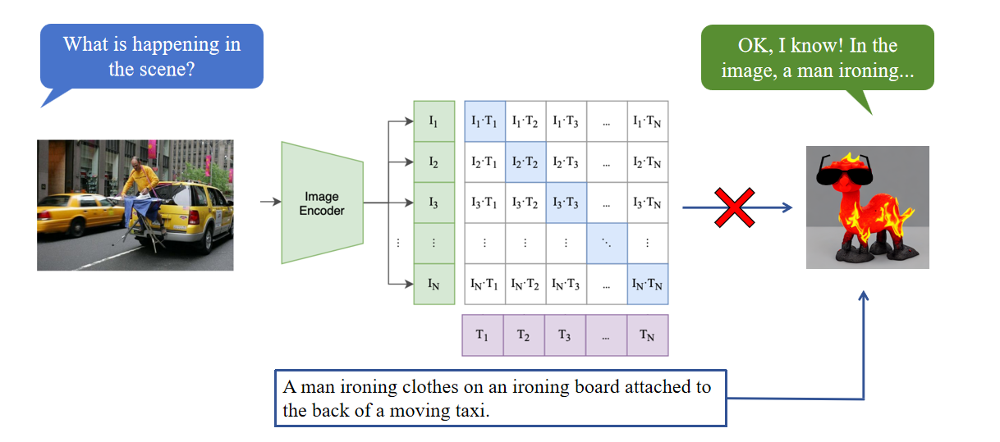
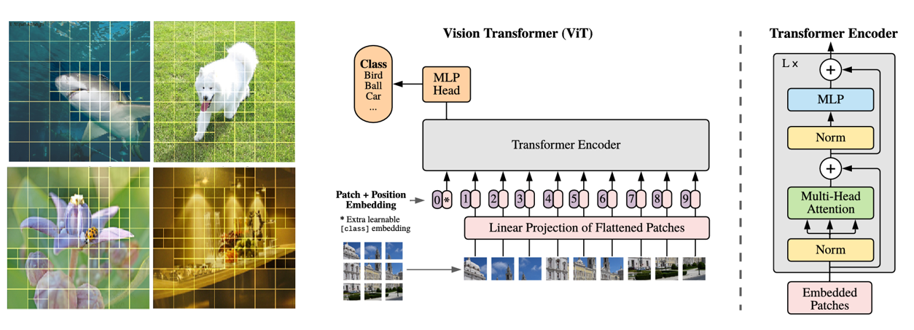
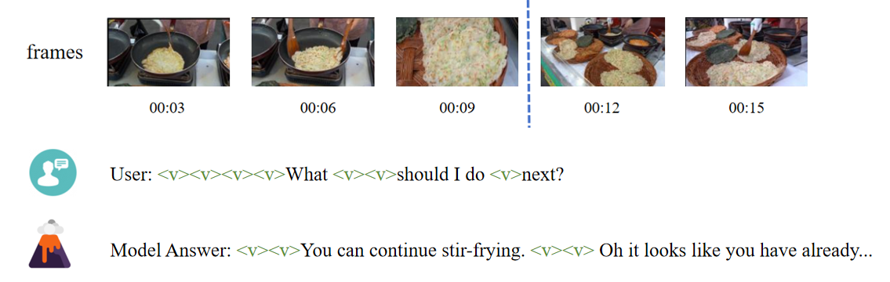
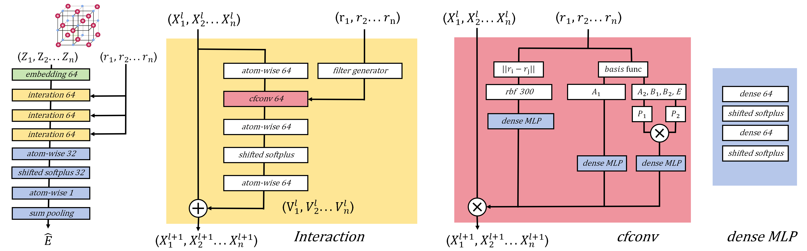
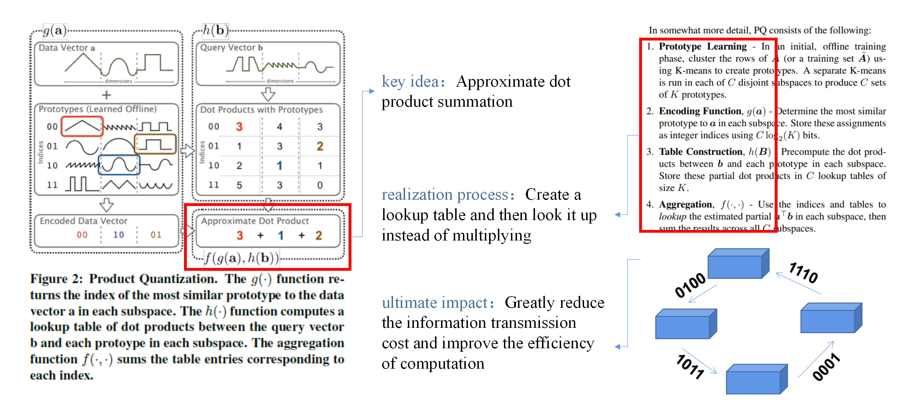
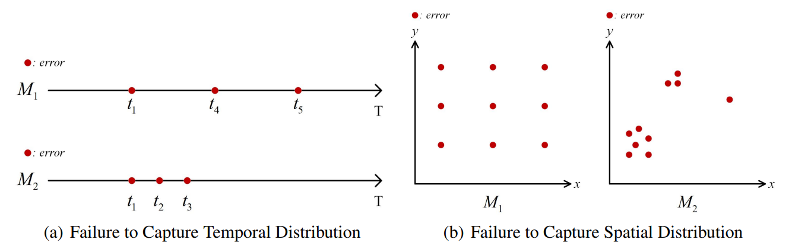
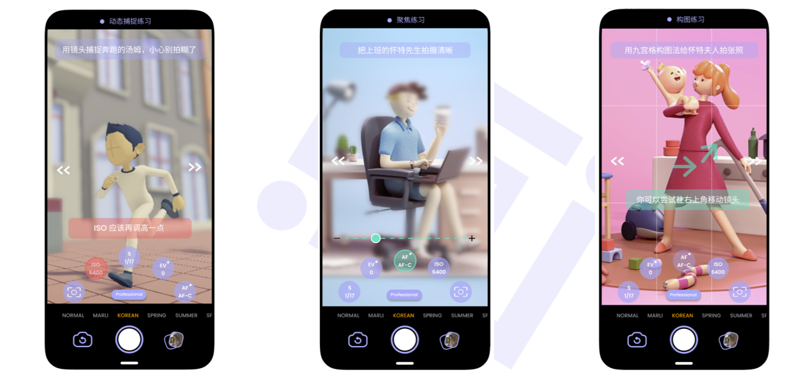








# Welcome! 
I am currently a forth-year undergraduate in the School of Software Engineering at [Tongji University](https://sse.tongji.edu.cn/), and also a visiting student at [the University of California, Berkeley](https://www.berkeley.edu/) since January 2024. My research focuses on data mining, multimodal learning, and natural language processing, especially exploring how to enable vision-language models (VLMs) to perceive the world, reason, and respond to their environment in a human-like manner, grounded in a multimodal context.

Previously, I have interned as a research assistant in the NaMI lab/ADE Lab at Tongji University, [MIT Media Lab's City Science Lab@Shanghai](https://www.media.mit.edu/projects/city-science-lab-shanghai/overview/), and the Department of Computer Science at [the University of Hong Kong](https://www.cs.hku.hk/). Currently, I am interning at [Berkeley NLP Group](https://nlp.cs.berkeley.edu/) within [Berkeley Artificial Intelligence Research (BAIR) Lab](https://bair.berkeley.edu/), working with [Prof. Alane](https://www.alanesuhr.com/) and [Dr. Zineng](https://zinengtang.github.io/) to explore the future of vision language models (VLMs).

<!--
From 2023 to 2024, I worked at [DouBao](https://www.doubao.com/chat/) as a daily intern in Beijing, undertaking data analytics cohort tasks under the guidance of Mr. Zhaojian Li.
-->

You can find my CV here: [Lingjun Mao's Curriculum Vitae](https://drive.google.com/file/d/1cYcl2w3z3J7tdv5NVDf3QYNRQ05bsLw6/view?usp=sharing). If you are interested in my work, please feel free to drop me an [email](lingjun@berkeley.edu).

I am currently seeking PhD opportunities for Fall 2025. If you have a suitable opportunity, please feel free to contact me.

<!--I have published more than 100 papers at the top international AI conferences with total <a href='https://scholar.google.com/citations?user=DhtAFkwAAAAJ'>google scholar citations <strong>260000+</strong></a> (You can also use google scholar badge ).-->

<!--插入图片语法为：-->

# 🔥 News
- *2024.09*: &nbsp;Our work on multi-perspective communication has been accepted by EMNLP main 2024.
- *2024.09*: &nbsp;Our work on multimodal instruction-tuning for biomedicine is accepted by NeurIPS D&B 2024!
- *2024.06*: &nbsp;🎉🎉Our paper "Among Agents" is accepted at ACL Wordplay Workshop 2024. See you in Bangkok!
- *2024.01*: &nbsp;Thrilled to join the Berkeley NLP Group as an intern! Go bears!
- *2023.11*: &nbsp;Accepted into the Berkeley Global Access program. Looking forward to California!🐻🔥
- *2023.07*: &nbsp;Accepted into the University of Hong Kong's CS summer research internship. A wonderful summer with Prof. Chuan Wu and Dr. Junwei Su!
- *2022.02*: &nbsp;Join the MIT Media Lab's CSL@Shanghai.

# ✍️ Ongoing Projects 
Notice: All content is for reference only. Research directions and team members are all subject to change!

[VLMs Are Blind! They are Just Listenser Instead of Obsearver]()

**Lingjun Mao**, Zineng Tang, Alane Suhr 

[**Project**]() | <strong>Comming Soon</strong>
- Content to be released soon.

[Dynamic Tokenization: Not Every Image Needs 256 Tokens]()

**Lingjun Mao**, Rudy Corona, Zineng Tang

[**Project**]() | <strong>Comming Soon</strong>
- Content to be released soon.

[Towards Real-time Interactive Video Language Models]()

Jessy Lin, Jiayi Pan, Zineng Tang, Sanjay Subramanian, **Lingjun Mao**, Dan Klein, Alane Suhr 

[**Project**]() | <strong>Comming Soon</strong>
- Content to be released soon.

# 📝 Publications 

[Evaluating Model Perception of Color Illusions in Photorealistic Scenes](https://arxiv.org/abs/2412.06184)

**Lingjun Mao**, Zineng Tang, Alane Suhr 

[**Project**](https://arxiv.org/abs/2412.06184) | <strong>CVPR 2025</strong>
- We propose an automated framework for generating realistic illusion images and creat a large, realistic dataset (RCID) of color illusion images.
- We investigate the underlying mechanisms of color illusions.

[Grounding Language in Multi-Perspective Referential Communication](https://arxiv.org/abs/2410.03959)

Zineng Tang, **Lingjun Mao**, Alane Suhr 

[**Project**](https://arxiv.org/abs/2410.03959) | <strong>EMNLP main 2024</strong>
- We introduce a task and dataset for referring expression generation and comprehension in multi-agent embodied environments.

<!--
[**Project**](https://scholar.google.com/citations?view_op=view_citation&hl=zh-CN&user=DhtAFkwAAAAJ&citation_for_view=DhtAFkwAAAAJ:ALROH1vI_8AC) <strong></strong>
- Lorem ipsum dolor sit amet, consectetur adipiscing elit. Vivamus ornare aliquet ipsum, ac tempus justo dapibus sit amet. 

-->

[AMONGAGENTS: Evaluating Large Language Models in the Interactive Text-Based Social Deduction Game](https://arxiv.org/abs/2407.16521)

Yizhou Chi, **Lingjun Mao**, Zineng Tang

[**Project**](https://arxiv.org/abs/2407.16521) | <strong>ACL Wordplay Workshop 2024</strong>
- This paper focuses on creating proxies of human behavior in simulated environments, with “Among Us” utilized as a tool for studying simulated human behavior.

[Biomedical Visual Instruction Tuning with Clinician Preference Alignment](https://biomed-vital.github.io/)

 Hejie Cui*, **Lingjun Mao\***, Xin Liang, Jieyu Zhang, Hui Ren, Quanzheng Li, Xiang Li, Carl Yang

[**Project**](https://biomed-vital.github.io/) | <strong>NeurIPS D&B 2024</strong>
- we propose a data-centric framework (Biomed-VITAl) that incorporates clinician preferences into both stages of generating and selecting instruction data for tuning biomedical multimodal foundation models.

[BG-HGNN: Toward Scalable and Efficient Heterogeneous Graph Neural Network](https://arxiv.org/abs/2403.08207)

Junwei Su*, **Lingjun Mao\***, Chuan Wu

[**Project**](https://arxiv.org/abs/2403.08207) | <strong>Submitted to AAAI 2025</strong>
- We first highlights and demonstrates that the standard approach employed by existing HGNNs inevitably leads to parameter explosion and relation collapse.

[AI Agent as Urban Planner: Steering Stakeholder Dynamics in Urban Planning via Consensus-based Multi-Agent Reinforcement Learning](https://arxiv.org/abs/2310.16772) 

Kejiang Qian, **Lingjun Mao**, Xin Liang, Yimin Ding, Jin Gao, Xinran Wei, Ziyi Guo, Jiajie Li

[**Project**](https://arxiv.org/abs/2310.16772) | <strong>Submitted to TKED</strong>
- we introduce a Consensus-based Multi-Agent Reinforcement Learning framework for real-world land use readjustment.

# 🎖 Honors and Awards
- *2024* Berkeley Global Access Scholarship (10 in all)
- *2023* Xiangcheng High-Tech Scholarship
- *2023* Xiangcheng High-Tech Scholarship
- *2023* China Collegiate Computing Contest (CCCC) China Second Prize
- *2023* China Collegiate Computing Contest (CCCC) Shanghai First Prize
- *2023* Shanghai Innovation and Entrepreneurship Project Award
- *2023* ETH Beijing Hackathon finalist
- *2022* National-level Innovation and Entrepreneurship Project Award
- *2022* Second prize in the Gobang AI algorithm competition of Tongji University
- *2022* Excellent backbone of Tongji University Student Union
- *2022* Outstanding Students of Tongji University (5%)
- *2022/2023* Third Prize of Asia Pacific Cup Mathematical Modeling
- *2022* Winner of "Crestron" Circular Economy Competition
- *2021* Third Prize in Mathematical Modeling, Tongji University
- *2021/2022* Tongji University Scholarship for Outstanding Undergraduate Students (5%)

# 📖 Educations
- *2024.01 - 2024.10*, Visiting Student (Berkeley Global Access Exchange Program) in University of California, Berkeley, USA
  - Supervised by [Prof. Alane Suhr](https://www.alanesuhr.com/)
- *2020-2025(expected)*, Software Engineering, Tongji University, Shanghai, China
  - Supervised by [Prof. Zhen Gao](https://scholar.google.com/citations?user=4ylyExkAAAAJ) and [Prof. Qingjiang Shi](https://scholar.google.com/citations?user=8xoKeR0AAAAJ)

<!--
# 💬 Invited Talks
- *2021.06*, Lorem ipsum dolor sit amet, consectetur adipiscing elit. Vivamus ornare aliquet ipsum, ac tempus justo dapibus sit amet. 
- *2021.03*, Lorem ipsum dolor sit amet, consectetur adipiscing elit. Vivamus ornare aliquet ipsum, ac tempus justo dapibus sit amet.  \| [\[video\]](https://github.com/)
-->

# 💻 Internships
- *Feb 2024 - Present*: Berkeley NLP Group, Berkeley Artificial Intelligence Research (BAIR) Lab
- *Nov 2023 - Present*: Department of Computer Science, Emory University
- *Apr 2023 - Present*: Department of Computer Science, University of Hong Kong
- *Apr 2022 - Nov 2023*: City Science Lab@Shanghai (MIT Media Lab)
- *Sept 2021 - Nov 2023*: Tongji ADE Lab
- *May 2021 - Apr 2023*: Tongji NaMI Lab

------

# 📚 Projects 

[Equivariant Neural Networks on Discrete Symmetry Groups]()

Krishnakumar Bhattaram, **Lingjun Mao**, Markian Rybchuk

[**Project**]() | <strong>Research Project</strong>
-  we introduce an equivariant approach targeting specific discrete symmetry groups with the hypothesis that restricting the function space of learned equivariant functions to the eigenbasis of the Hamiltonian will provide a useful inductive bias and reduced data complexity.

[A distributed neural network computation acceleration method based on meta-representation]()

Kaiyu Huang, **Lingjun Mao**, Qingjiang Shi

[**Project**]() | <strong>Research Project</strong>
-  We replaced the last fully connected layer of the traditional neural network with coded quantized matrix multiplication and compared it with the speed and accuracy of the traditional neural network.

[Rethinking of Generalization in Dynamic System]()

Junwei Su, **Lingjun Mao**, Mengfan Liu, Chuan Wu

[**Project**]() | <strong>Research Project</strong>
-  We point out the flaws in current evaluation methods, which don’t fully consider the dynamic and time-sensitive nature of these networks. 

[JourneyCam: VR-assisted photography teaching APP](https://youtu.be/Hek6Hc7RJVE)

**Lingjun Mao**, Xin Liang, Manxin Xu

[**Project**](https://youtu.be/Hek6Hc7RJVE) | <strong>CCCC 2023 Award-Winning Work</strong>
- JourneyCam is a VR-assisted photography teaching app whose core function is to provide tutorials on professional photography with cell phones.

[FactLENS DAO -A Decentralized News Validation Ecosystem]()

**Lingjun Mao**, Xin Liang, Chance Jiajie Li, Nina Wang, Yongqi Li

[**Project**](https://www.ethbeijing.xyz/) | <strong>ETH Beijing Hackathon Award-Winning Work</strong>
- FactLENS is a decentralized news validation ecosystem, which consists of FactLENS plugin and FactLENS website.

[SoCity DAO - Green Commute](https://youtu.be/BcfJdC5VrAc)

Ryan Zhang, Chance Li, Charlotte Ge, Kejiang Qian, **Lingjun Mao**, Xin Liang, Chengliang Li

[**Project**](https://youtu.be/BcfJdC5VrAc) | <strong>non-profit organization</strong>
- SoCity is a non-profit organization to promote prosocial behaviors with decentralized incentive policies. It is conducted by City Science group (MIT Media Lab) and City Science Lab Shanghai (Tongji University).

------

  <i>2024@Lingjun Mao</i>

